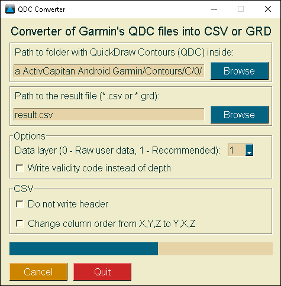

[Русский](https://github.com/interlark/qdc-converter/blob/main/README.md) | [English](https://github.com/interlark/qdc-converter/blob/main/README.en.md)

# QDC Converter

Converter of ***.qdc** *(Garmin QuickDraw Contours)* files into ***.csv** *(CSV table)* or ***.grd** *(ESRI ASCII Grid Raster)*



# Install
- Download [release](https://github.com/interlark/qdc-converter/releases/latest) and run.

- Install from PyPI:
```bash
# CLI
pip install qdc-converter
# CLI + GUI
pip install qdc-converter[gui]
```

- Install from repository:
```bash
git clone https://github.com/interlark/qdc-converter
cd qdc-converter

python -m venv venv

# Windows
.\venv\Scripts\activate.bat
# Linux, MacOS
. venv/bin/active

# CLI
pip install .
# CLI + GUI
pip install .[gui]
```

# Usage
Base parameters: **-i**, **-o** and **-l**.

* An example of converting folder ```Contours``` which contains ***.qdc** files inside into table ```export_table.csv``` with 3 columns ```X``` *(longitude in decimal degrees)*, ```Y``` *(latitude in decimal degrees)* и  ```Depth(m)``` *(depth in meters)*, using data layer L_**1**:
  ```
  qdc-converter -i "Contours" -o "export_table.csv" -l 1
  ```

* An example of converting folder ```Contours``` which contains ***.qdc** files inside into raster ```export_raster.grd```, using data layer L_**0**:
  ```
  qdc-converter -i "Contours" -o "export_raster.grd" -l 0
  ```
  The result raster could be loaded into many other GIS, like QGIS, etc... and get converted into more readable formats.


# Parameters
```bash
qdc-converter --help
```
```
Usage: qdc-converter [OPTIONS]

  QDC converter.

  Converter of Garmin's QDC files into CSV or GRD.

Options:
  Main parameters:                Key parameters of the converter
    -i, --qdc-folder-path DIRECTORY
                                  Path to folder with
                                  QuickDraw Contours (QDC) inside.  [required]

    -o, --output-path FILE        Path to the result file (*.csv or
                                  *.grd).  [required]

    -l, --layer [0,1,2,3,4,5]     Data layer (0 - Raw user data, 1 -
                                  Recommended).  [required]

    -vc, --validity-codes         Write validity code instead of depth.
    -q, --quite                   "Quite mode"
  Correction parameters:          Corrections
    -dx, --x-correction FLOAT     Correction of X.
    -dy, --y-correction FLOAT     Correction of Y.
    -dz, --z-correction FLOAT     Correction of Z.
  CSV parameters:                 Parameters related to CSV
    -csvd, --csv-delimiter TEXT   CSV delimiter (default ",").
    -csvs, --csv-skip-headers     Do not write header.
    -csvy, --csv-yxz              Change column order from X,Y,Z to Y,X,Z.

  --help                          Show this message and exit.

```
